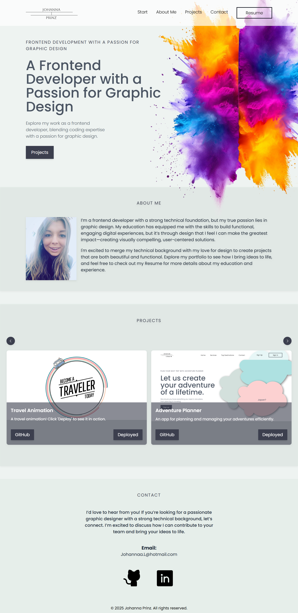

#   My Portfolio 🎨 💻

### Welcome to my online portfolio!
I’m excited to share my creative and professional journey with you. Here, you’ll find a curated collection of my work, showcasing both my design skills and development expertise. 

From visually engaging designs to dynamic web applications, each project reflects my passion for problem-solving and creativity. 

Take a look around to explore my work, learn more about my skills, and get a glimpse of the thought process behind each project.

---

## 🌐 Live Demo

Experience my portfolio in action!

**Click the link below to explore my design and development projects, as well as my resume.**

**https://portfolio-johannaprinz.vercel.app/** 

---

## 🚀 Features

- Responsive Design: Fully optimized for seamless viewing across all devices, from desktops to smartphones, ensuring a smooth user experience everywhere.

- Interactive Projects: Explore a range of development projects that showcase my technical abilities and creativity. Dive into each project to understand the thought process, challenges, and solutions behind the work. You can view the source code on GitHub or try the live version by visiting the deployed app to see it in action!

- Skills & Resume: Access a detailed overview of my technical skills, programming languages, and frameworks. You can also download my up-to-date resume for a comprehensive view of my professional background.

---

## 🔧 Tech Stack

- React: For building dynamic and responsive user interfaces.

- Tailwind CSS: For modern, flexible, and fast styling.

- TypeScript: For type safety and enhanced development experience.

---

## 👩‍💻 Created By

**This portfolio was developed by Johanna Prinz. Feel free to connect with me on GitHub or LinkedIn!**

---

## 📸 Portfolio Preview

<!--  -->

---

#### Published: Year 2025

---

